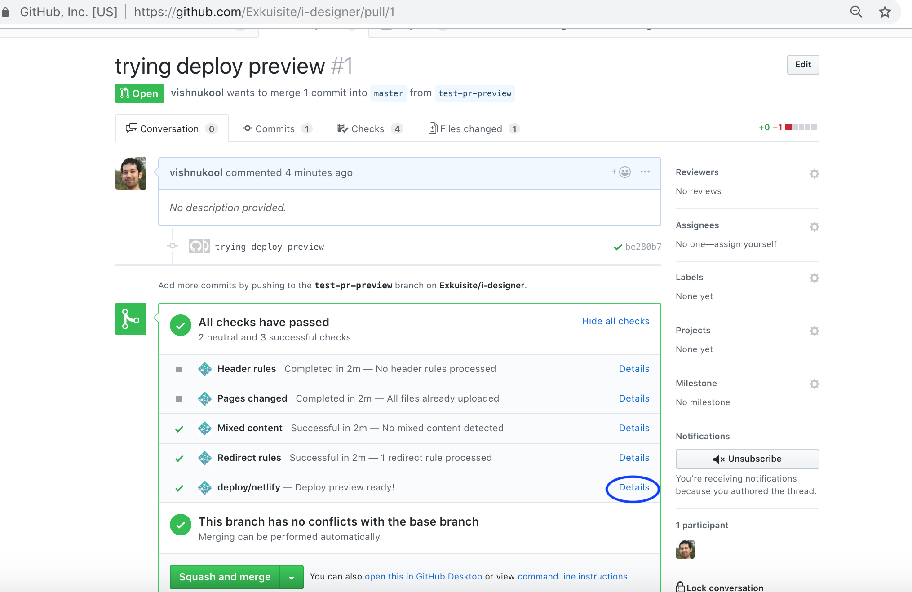

# Planner Application
We are building the future of interior design and e-commerce. This application is based on the [react-planner](https://github.com/cvdlab/react-planner-mobile) codebase.
The running version of the app is [here](https://suite.netlify.com)
# Project strcuture

The codebase has two primary root folders where we will be adding code 1. demo and 2. src 

1. demo - this has all the 3D model catalog (.obj files and 3D catalog information). This file also has main file `renderer.jsx`
which bootstraps the application. It also has the React-Router root configuration. We will not add any react components 
in this folder. Ideally this folder should not exist and be merged into the src folder. It exists for legacy reasons.

2. src - this has all the react components, styles, actions, reducers, utils, config. Any new components introduced will sit here. 
  
# Application Conventions
* We use double spaces as the default indentation.

# Deployment
* To deploy your changes open a Pull Request to `master` branch from your `feature-branch`.
* Once you receive at-least one Approval merge you may merge your branch to `master`.
* The application is automatically deployed when there is a push to the `master` branch.
* When you open a Pull Request the version of the code in PR is deployed by netlify to preview the changes. This 
can be accessed by clicking on the details link in PR check (see image below for reference).
* This deployment is kick-started by a service called Netlify. It is similar to Heroku but much better.
* The latest version in master is always running [here](https://suite.netlify.com).





# react-planner

*react-planner* which this repo is based from is a [React][react] component which can be used to draw model buildings. Drag & drop from a catalog of customizable and ready-to-use objects, you can start from 2D wireframes and land on 3D models. As a developer you can provide your users with new objects by adding them to the catalog.

## Usage

``` es6
import React from 'react';
import ReactDOM from 'react-dom';
import {Map} from 'immutable';
import {createStore} from 'redux';
import {Provider} from 'react-redux';

//download this demo catalog https://github.com/cvdlab/react-planner/tree/master/demo/src/catalog
import MyCatalog from './catalog/mycatalog';

import {
  Models as PlannerModels,
  reducer as PlannerReducer,
  ReactPlanner,
  Plugins as PlannerPlugins,
} from 'react-planner';


//define state
let AppState = Map({
  'react-planner': new PlannerModels.State()
});

//define reducer
let reducer = (state, action) => {
  state = state || AppState;
  state = state.update('react-planner', plannerState => PlannerReducer(plannerState, action));
  return state;
};

let store = createStore(reducer, null, window.devToolsExtension ? window.devToolsExtension() : f => f);

let plugins = [
  PlannerPlugins.Keyboard(),
  PlannerPlugins.Autosave('react-planner_v0'),
  PlannerPlugins.ConsoleDebugger(),
];

//render
ReactDOM.render(
  (
    <Provider store={store}>
      <ReactPlanner
        catalog={MyCatalog}
        width={800}
        height={600}
        plugins={plugins}
        stateExtractor={state => state.get('react-planner')}
      />
    </Provider>
  ),
  document.getElementById('app')
);

```

## Docs

- [Create a Property](docs/HOW_TO_CREATE_A_PROPERTY.md)
- [Create a Catalog](docs/HOW_TO_CREATE_A_CATALOG.md)
- [Create a Catalog's Element](docs/HOW_TO_CREATE_AN_ELEMENT.md)

